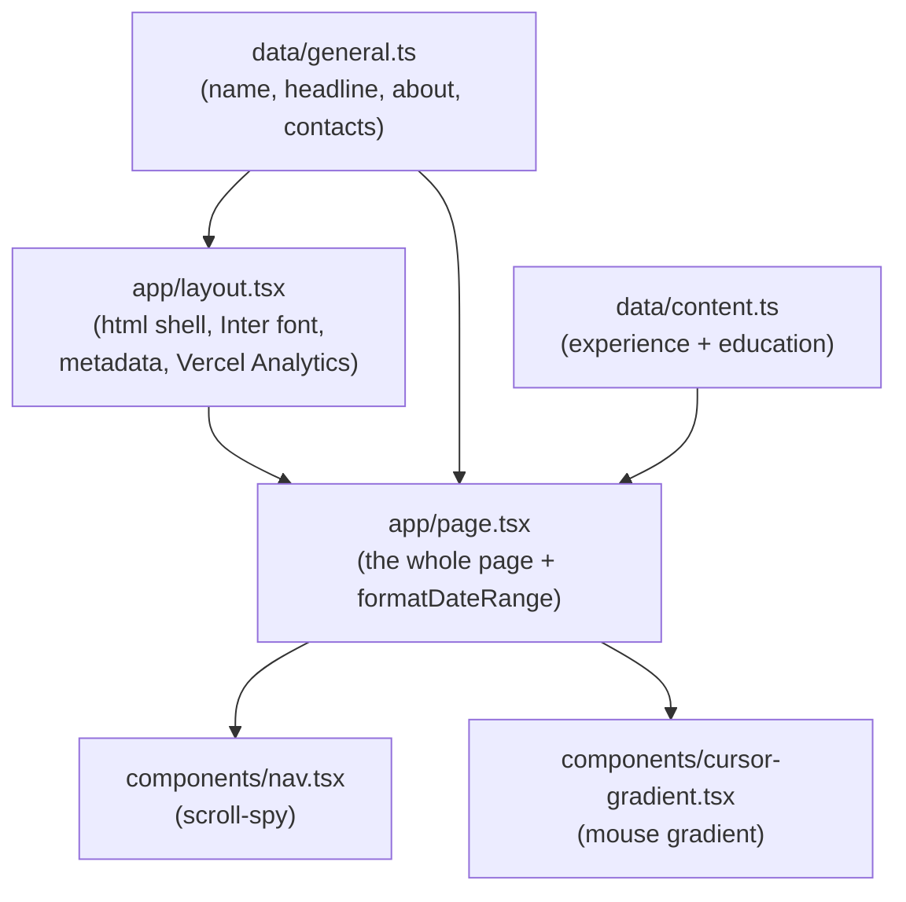

# Architecture & Behaviour

How this project is put together and what it does at runtime. If you only want
to change the words on the site, jump to [Editing content](#editing-content).

## What this is

A single-page personal CV / portfolio site for Theo Archer, deployed at
[theoarcher.me](https://theoarcher.me). It is a Next.js 13 App Router app,
styled with Tailwind CSS, written in TypeScript, and hosted on Vercel.

The site is content-driven: all the visible text lives in two data files
(`data/general.ts` and `data/content.ts`), and the page components render that
data. There is no database, no API, and no client-side data fetching. Every
page is static.

## What a visitor sees

There is a single route, `/`, served as a static, server-rendered page with a
hardcoded dark palette (`neutral-900` background, emerald accents).

On desktop (`lg` and up) the layout is two columns:

- **Left sidebar (sticky):** name, headline, a one-line tagline, a scroll-spy
  navigation list, and social links (LinkedIn, GitHub, email).
- **Right column (scrolls):** About, Experience, and Education sections, then a
  footer.

On smaller screens the two columns stack into a single scrolling column and the
sidebar navigation is hidden.

### Interactive behaviour

Three things on the page respond to the user; everything else is static markup.

| Behaviour | Where | How it works |
|-----------|-------|--------------|
| Scroll-spy nav | `components/nav.tsx` | An `IntersectionObserver` watches the `#about`, `#experience` and `#education` sections and highlights the matching nav item as you scroll. |
| Cursor gradient | `components/cursor-gradient.tsx` | A fixed, full-screen radial gradient follows the mouse pointer. Desktop only (`hidden lg:block`), and `pointer-events-none` so it never blocks clicks. |
| Entry hover | `app/page.tsx` | Experience and Education entries dim their siblings and lift/tint themselves on hover, using Tailwind `group` utilities. No JS. |

> **Note:** the palette is fixed to dark. There is no light/dark toggle.

## How it is built

The active render path is small:



That is the entire live surface. `app/page.tsx` reads both data files, splits
`contentData` into the Experience and Education sections, and renders them.
`app/layout.tsx` builds the page `<title>`, meta description and Open Graph tags
from `generalData`, loads the Inter font via `next/font`, and mounts Vercel
Analytics.

Dates are formatted by a single helper in `app/page.tsx`:

```ts
// "2024-10-01", null  ->  "OCT 2024 – PRESENT"
formatDateRange(startDate, endDate)
```

It uppercases `MON YYYY`, joins the two ends with an en dash, and prints
`PRESENT` when `endDate` is `null`.

## Content model

All content is typed in `data/content.ts`. The shape is a list of sections,
each holding institutions, each holding roles:

```
ContentData = Content[]
  Content     = { title, institutions[] }        // e.g. "Experience", "Education"
    Institution = { name, image, roles[] }        // e.g. "The Warehouse Group"
      Role        = { id, title, subTitle, startDate, endDate, description, skills? }
```

- `startDate` / `endDate` are ISO date strings; `endDate: null` renders as
  `PRESENT`.
- `skills` is optional. The Experience section renders each role's `skills` as
  emerald pill tags; the Education section ignores `skills` even if present.
- `id` must be unique per role. It is used as the React list key.
- `subTitle` (e.g. a location) is present in the data but is **not** rendered by
  the current page.

`data/general.ts` holds the sidebar and metadata content:

- `name`, `jobTitle` (the headline under the name), `about` (an array of
  paragraphs rendered in the About section, whose first entry also becomes the
  meta description), `website` (the LinkedIn URL behind the LinkedIn icon), and
  `contacts` (each rendered as a social icon; currently just email).
- `avatar` is defined but not rendered by the current page.

The GitHub link and the tagline ("I ship integrations that keep commerce
moving.") are currently hardcoded in `app/page.tsx`, not read from data.

### Editing content

- **Change wording, roles, skills, dates:** edit `data/content.ts` and
  `data/general.ts`. The page updates automatically in `npm run dev`.
- **Add a job:** add a `Role` object to the relevant institution's `roles`
  array, with a unique `id`.
- **Add an organisation:** add an `Institution` object (with a logo in
  `public/images/`) to a section's `institutions` array.
- **Change the headline / tagline:** `jobTitle` in `data/general.ts` for the
  headline; the tagline string is inline in `app/page.tsx`.

## Configuration and build

| File | Purpose |
|------|---------|
| `package.json` | Scripts: `dev`, `build`, `start`, `lint`. |
| `next.config.js` | Enables remote images from `github.com`. All logos currently used are local under `public/images/`. |
| `tailwind.config.js` | `darkMode: "class"` and the content globs for `app/`, `components/` and `pages/`. |
| `app/globals.css` | Just the three Tailwind layer imports. |
| `app/icon.svg` | Favicon: a dark rounded square with an emerald "T". |
| `tsconfig.json` | `@/*` path alias maps to the project root. |

Common commands:

```bash
npm install     # install dependencies
npm run dev     # local dev server at http://localhost:3000
npm run build   # production build
npm run lint    # eslint (next lint)
npx tsc --noEmit  # type-check only
```

## Deployment

Hosted on Vercel via the GitHub integration. `main` is the production branch:
pushing to `main` triggers a production deploy. Other branches produce preview
deployments only. There is no `vercel.json`; deploy settings live in the Vercel
dashboard.
